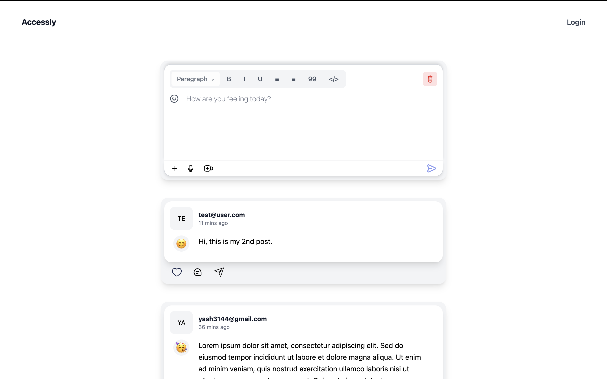
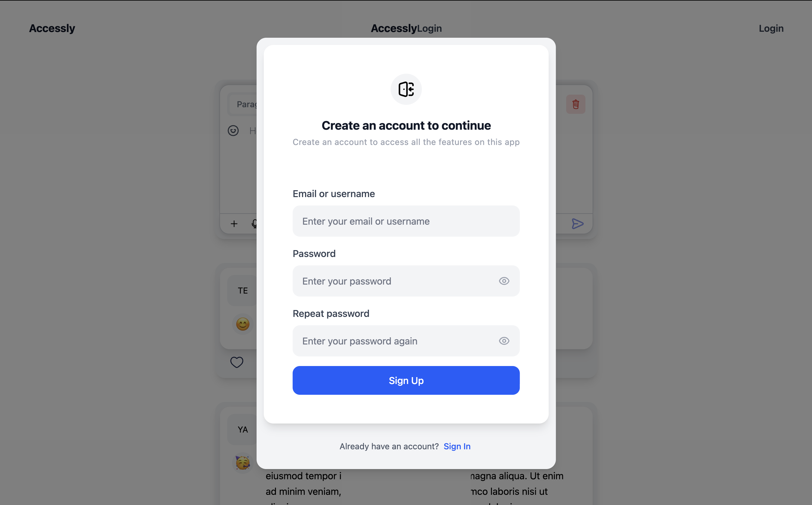
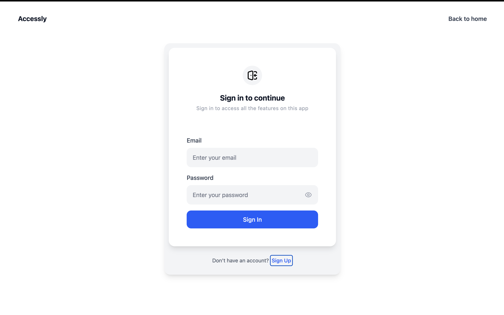
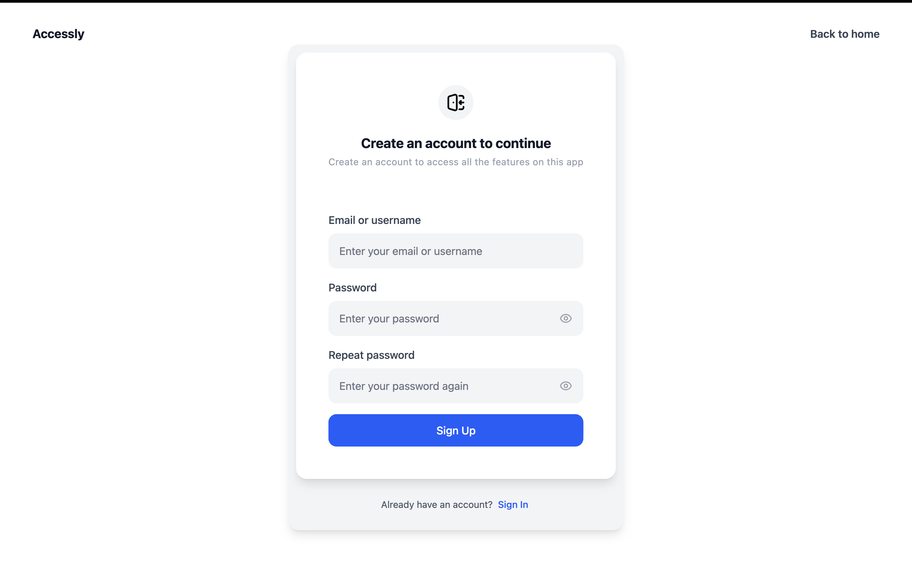

# Accessly

A modern social media application built with React, TypeScript, and Tailwind CSS, implementing a complete authentication flow and interactive feed.

🔗 **Live Demo**: [https://accessly-git-main-yashhhguptaaas-projects.vercel.app/](https://accessly-git-main-yashhhguptaaas-projects.vercel.app/)

## ✅ **Implemented Features**

- **Three Main Pages**: Feed (landing page), Sign In (`/login`), and Sign Up (`/signup`)
- **Authentication Flow**: Modal-based auth for unauthenticated users, dedicated auth pages
- **Post Editor**: Input field and publish button functionality (other buttons show "function not implemented" alerts)
- **Feed Interactions**: Published posts appear in feed, interactive elements show appropriate alerts
- **Responsive Design**: Mobile-first approach with Tailwind CSS

## 🛠️ Tech Stack

- **React 19.1.1** - Latest version with modern hooks and patterns
- **TypeScript 5.9.3** - Complete type safety and IntelliSense
- **Tailwind CSS 4.1.14** - Utility-first CSS framework (no UI libraries used)
- **Vite 7.1.7** - Lightning-fast development and build tool
- **React Router DOM 7.9.4** - Client-side routing
- **Supabase 2.75.1** - Backend-as-a-Service for authentication and data storage
- **React Hot Toast 2.6.0** - User notifications

## 📱 Application Flow

### **Unauthenticated Users**

- **Landing Page**: Feed page loads, but interactions trigger authentication modal
- **Authentication Modal**: Sign In/Sign Up toggle with form validation
- **Dedicated Auth Pages**: Direct links to `/login` and `/signup`

### **Authenticated Users**

- **Full Feed Access**: Create posts, view all posts, interact with content
- **Post Creation**: Rich text input with emoji support and formatting options
- **Real-time Updates**: New posts appear instantly via Supabase subscriptions

## 📸 Screenshots

Here are some visual previews of the application's key interfaces:

### **Homepage & Feed**




### **Authentication Pages**




## 🏗️ Project Structure

```
src/
├── components/          # Reusable React components
│   ├── auth/           # Authentication components
│   │   ├── AuthPage.tsx       # Main auth page with routing
│   │   ├── SignInForm.tsx     # Sign in form
│   │   ├── SignUpForm.tsx     # Sign up form
│   │   └── FormFooter.tsx     # Auth form footer
│   ├── Feed/           # Feed-related components
│   │   ├── index.tsx          # Main feed component
│   │   ├── Post.tsx           # Individual post display
│   │   ├── WritePost.tsx      # Post creation component
│   │   ├── ActionButtons.tsx  # Post action buttons
│   │   ├── EmojiSelector.tsx  # Emoji picker
│   │   └── FormattingToolbar.tsx # Text formatting tools
│   ├── Header/         # Application header
│   │   ├── index.tsx          # Header component
│   │   └── ActionButton.tsx   # User action button
│   ├── Layout/         # Layout components
│   ├── Input/          # Form input components
│   ├── Modal.tsx       # Modal component
│   ├── LoadingSpinner.tsx     # Loading indicator
│   └── Toast/          # Toast notifications
├── contexts/           # React contexts
│   └── AuthModalContext.tsx   # Auth modal state management
├── hooks/              # Custom React hooks
│   ├── useAuth.ts             # Authentication logic
│   ├── useAuthPage.ts         # Auth page state
│   ├── useCreatePost.ts       # Post creation logic
│   └── useFeed.ts             # Feed data management
├── lib/                # External service integrations
│   └── supabase.ts           # Supabase client configuration
├── router/             # Application routing
│   └── index.tsx             # React Router configuration
├── utils/              # Utility functions
│   ├── auth.ts               # Authentication utilities
│   ├── post.ts               # Post-related utilities
│   ├── session.ts            # Session management
│   ├── toast.ts              # Toast notifications
│   └── validation.ts         # Form validation
├── types/              # TypeScript type definitions
│   └── index.ts              # Global type definitions
├── App.tsx             # Main application component
├── main.tsx            # Application entry point
└── index.css           # Global styles with Tailwind
```

## 🔑 Key Features Implemented

### **Authentication System**

- **Modal Authentication**: Triggered by feed interactions for unauthenticated users
- **Dedicated Auth Pages**: Separate `/login` and `/signup` routes
- **Form Validation**: Real-time validation with error messages
- **Session Management**: Persistent authentication state
- **Toast Notifications**: User feedback for auth actions

### **Feed System**

- **Post Creation**: Rich text input with emoji and formatting support
- **Real-time Updates**: Live feed updates via Supabase subscriptions
- **Post Display**: Clean, responsive post layout with user avatars
- **Action Buttons**: Like, comment, share buttons with appropriate behavior
- **Responsive Design**: Mobile-first approach with Tailwind CSS

### **UI/UX Quality**

- **Modern Design**: Clean, Instagram-like interface
- **Smooth Animations**: Hover effects and transitions
- **Accessibility**: Proper ARIA labels and keyboard navigation
- **Loading States**: Skeleton screens and loading indicators
- **Error Handling**: Graceful error states with user feedback

## 🚀 Future Improvements

Here are some enhancements that could be implemented to further improve the application:

### **Post Creation & Editing**

- **Implement Toolbar Functionality**: Complete the rich text formatting toolbar with functional bold, italic, underline, paragraph styles, alignment options, quote formatting, and code block insertion
- **Enhanced Media Support**: Add image/video upload capabilities with drag-and-drop functionality

### **Security & Performance**

- **Secure Credential Storage**: Migrate from localStorage to HTTP-only cookies for enhanced security against XSS attacks
- **Implement Caching Strategy**: Add intelligent caching for user-specific posts and feed data to reduce API calls and improve load times
- **Optimize Scrolling Performance**: Implement virtual scrolling for the feed to handle large numbers of posts efficiently

### **Quality Assurance**

- **Comprehensive Test Coverage**: Write unit tests, integration tests, and end-to-end tests for all components and user flows
- **Accessibility Testing**: Ensure WCAG compliance and screen reader compatibility
- **Performance Monitoring**: Add analytics and monitoring for user interactions and system performance

### **Advanced Features**

- **Real-time Collaboration**: Enable multiple users to edit posts simultaneously
- **Advanced Search & Filtering**: Implement search functionality with filters for date, author, and content type
- **Push Notifications**: Add browser notification support for new posts and interactions

## 🔧 Development Notes

### **Code Quality**

- **TypeScript**: Full type coverage for better developer experience
- **ESLint**: Consistent code style and error prevention
- **Component Architecture**: Modular, reusable components
- **Custom Hooks**: Separation of logic from presentation
- **Context API**: Efficient state management

### **Performance**

- **Vite**: Fast development and optimized production builds
- **Tree Shaking**: Only used code included in bundles
- **Lazy Loading**: Components loaded as needed
- **Hot Module Replacement**: Instant updates during development

### **Scalability**

- **Modular Structure**: Easy to extend and maintain
- **Reusable Components**: DRY principle throughout
- **Type Safety**: Prevents runtime errors
- **Clean Architecture**: Separation of concerns
